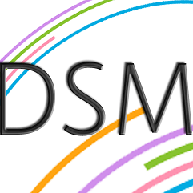

# [DSM Services](https://github.com/DogusTeknoloji/DSM.Agents.MonitorService)

**[DSM]** is an middleware management and reporting tool designed to be strong and simple. It is build with C#. It can be used to collect IIS Site info,bindings,logs,site backends and more...

The product represents a big suite of middleware management tools that can help you easily watch and manage your services. 

## Technical Support or Questions

If you have questions or need help integrating the product please [contact us](https://www.d-teknoloji.com.tr).

## Licensing

- Copyright 2019 Doğuş Teknoloji - DUY